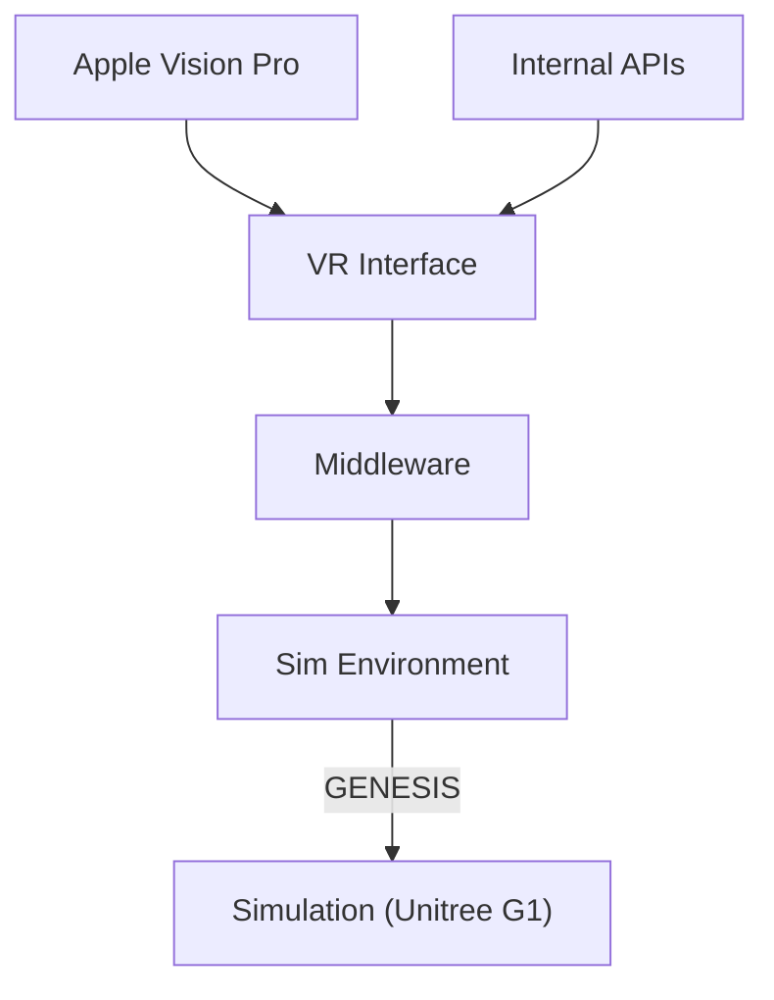

# Robot Simulation and VR Interface Architecture

This document describes the architecture for our robot simulation system, which integrates a Virtual Reality (VR) interface with a simulation environment for the Unitree G1 robot. The architecture leverages a FastAPI-based middleware server to communicate between various components, including an immersive VR interface (e.g., running on the Apple Vision Pro), simulation backends, and internal APIs.

## High-Level Architecture Overview



## Components Description

### 1. VR Interface

- **Role:** Provides an immersive user experience for interacting with the robot simulation.
- **Deployment:** Can run on devices like the Apple Vision Pro.
- **Functionality:** 
  - Receives user inputs (e.g., movement commands, configuration changes).
  - Displays real-time simulation feedback.
  - Communicates with the middleware server using HTTP or WebSocket connections.

### 2. Middleware (FastAPI Server)

- **Role:** Acts as the central communication hub, bridging the VR interface and the simulation environment.
- **Technology:** Built using [FastAPI](https://fastapi.tiangolo.com/).
- **Functionality:**
  - Receives commands and requests from the VR interface.
  - Forwards commands to the simulation environment or the robot API library.
  - Retrieves simulation status and telemetry data to relay back to the VR interface.
  - Integrates with internal APIs for additional features like logging, monitoring, or telemetry.

#### Example FastAPI Server

Below is a simple example of a FastAPI server that handles status queries and command requests:

```python
from fastapi import FastAPI, HTTPException
from pydantic import BaseModel

app = FastAPI(title="Robot Simulation Middleware")

# Data model for incoming commands
class Command(BaseModel):
    action: str
    parameters: dict

@app.get("/status")
async def get_status():
    # This endpoint would typically query the simulation environment or robot model for current status
    return {"status": "Simulation running", "robot": "Unitree G1"}

@app.post("/command")
async def send_command(command: Command):
    # Process the command received from the VR interface
    action = command.action
    parameters = command.parameters

    # Validate action and implement logic to forward it to the simulation or robot API lib
    if action not in ["move", "stop", "rotate"]:
        raise HTTPException(status_code=400, detail="Invalid action")
    
    # Here you would typically call the simulation/robot control logic
    # For example: simulation.process_command(action, parameters)
    
    return {"result": "Command executed", "action": action, "parameters": parameters}

if __name__ == "__main__":
    import uvicorn
    uvicorn.run(app, host="0.0.0.0", port=8000)
```

### 3. Simulation Environment

- **Role:** Hosts the simulation of the Unitree G1 robot.
- **Technology & Libraries:**
  - Uses GENESIS for simulating the robot.
  - Integrates with the [Unitree SDK Python](https://github.com/unitreerobotics/unitree_sdk2_python) for low-level control.
  - Leverages [Unitree RL Gym](https://github.com/unitreerobotics/unitree_rl_gym) for reinforcement learning experiments.
- **Functionality:**
  - Simulates real-world physics and robot behavior.
  - Provides telemetry and feedback to the middleware.

### 4. Robot API Library and Robot Model

- **Role:** Abstracts the low-level control logic for the robot.
- **Functionality:**
  - Defines the robot model.
  - Provides APIs to interact with the simulated or real robot.
  - Serves as the connection point between the simulation environment and the actual robot control logic.

### 5. Apple Vision Pro Integration

- **Role:** Serves as the hardware platform for the VR interface.
- **Functionality:**
  - Runs the VR interface to provide an immersive experience.
  - Connects to the middleware server over the network to send user inputs and receive simulation feedback.
  - Utilizes native VR capabilities to enhance interactivity and visualization.

### 6. Internal APIs

- **Role:** Provide additional services such as telemetry, logging, monitoring, or other domain-specific functions.
- **Functionality:**
  - These APIs feed supplementary data into the VR interface.
  - Enhance the overall system by integrating diagnostics and analytics.

## Workflow Summary

1. **User Interaction:**  
   The user operates the VR interface (possibly on an Apple Vision Pro) to interact with the simulation (e.g., sending movement commands).

2. **Middleware Processing:**  
   The VR interface sends these commands to the FastAPI-based middleware server, which validates and processes the requests.

3. **Simulation Control:**  
   The middleware forwards the commands to the simulation environment where the Unitree G1 is simulated using GENESIS, along with additional robot API libraries.

4. **Feedback Loop:**  
   The simulation environment returns status updates and telemetry data to the middleware, which in turn relays this information back to the VR interface.

5. **Enhanced Interaction:**  
   Internal APIs can supply additional context and diagnostics to further enrich the VR experience.

## Setup & Installation

### Prerequisites

- **Python >3.9+**
- **FastAPI and Uvicorn:**  
  Install via pip:
  ```bash
  pip install fastapi uvicorn
  ```
- **Additional Dependencies:**  
  Install any additional libraries required by your simulation environment and VR interface.

### Installation Steps

1. **Clone the Repository:**
   ```bash
   git clone https://github.com/your-repo/robot-simulation.git
   cd robot-simulation
   ```

2. **Install Python Dependencies:**
   ```bash
   pip install -r requirements.txt
   ```

3. **Run the Middleware Server:**
   ```bash
   uvicorn main:app --reload
   ```

4. **Configure the VR Interface:**
   - Ensure the VR interface is set up to communicate with the FastAPI server endpoints.
   - Adjust network configurations to allow communication between your Apple Vision Pro and the middleware server.

# TODO(s) 
* Writeup which VR headset to use!
